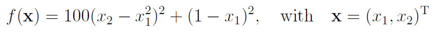
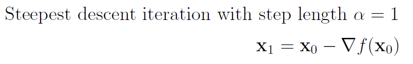
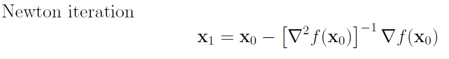

# -Rosenbrock-function-optimization-
Using steepest descent iteration and Newton iteration on the Rosenbrock function

# The Rosenbrock function

the Rosenbrock function with a = 100 and b = 1

the Rosenbrock function is a non-convex function, introduced by Howard H. Rosenbrock in 1960, which is used as a performance test problem for optimization algorithms
The global minimum is inside a long, narrow, parabolic shaped flat valley. To find the valley is trivial. To converge to the global minimum, however, is difficult.

Here we show that simple steeps descent is not going to converge to global minium, using Newton's iteraion the algorithm will converge quite quickly,do know that we only have two unknown, the hessian matrix is very expensive to calculate in large size.

## Contributing
Pull requests are welcome. For major changes, please open an issue first to discuss what you would like to change.

## License
[MIT](https://choosealicense.com/licenses/mit/)
